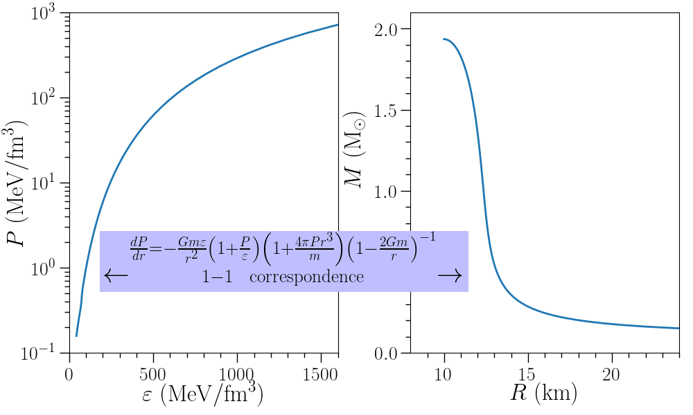
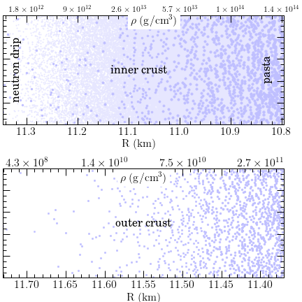
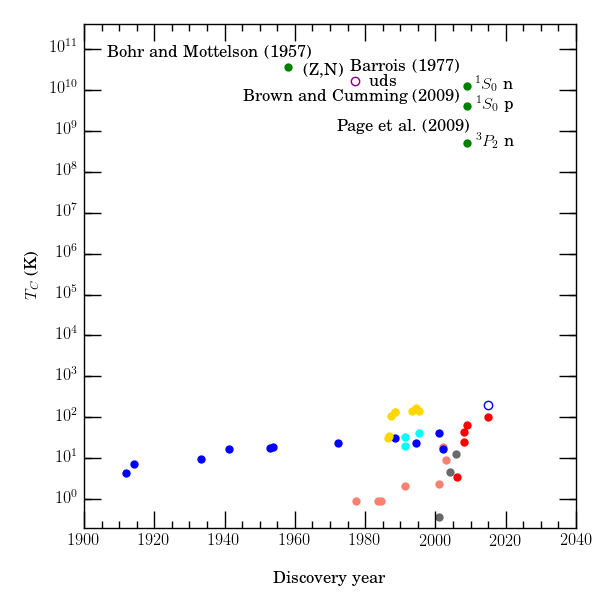
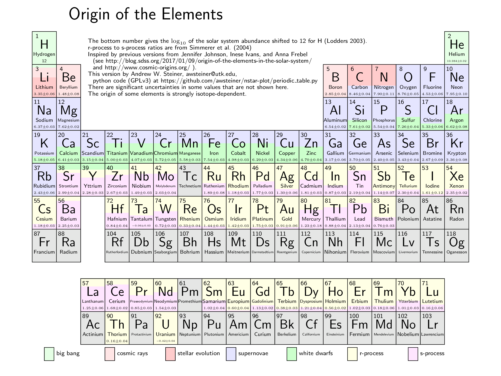

Neutron Star-Related Plots
==========================

This documentation was generated from git commit

.. include:: commit.rst

Neutron star plot
-----------------

Based on Dany Page's excellent work
`here <http://www.astroscu.unam.mx/neutrones/home.html>`_.

.. image:: ../nstar_plot.png
   :width: 70%

EOS and M-R curve plot
----------------------
	     

Neutron star crust plot
-----------------------
	     

History of superconductivity plot
---------------------------------

Based on P.J. Ray's work at [Ray15]_ .
	   

	     
Origin of the elements
----------------------
	   

	     
.. toctree::
   :maxdepth: 2

   bib

* :ref:`genindex`
* :ref:`modindex`
* :ref:`search`
