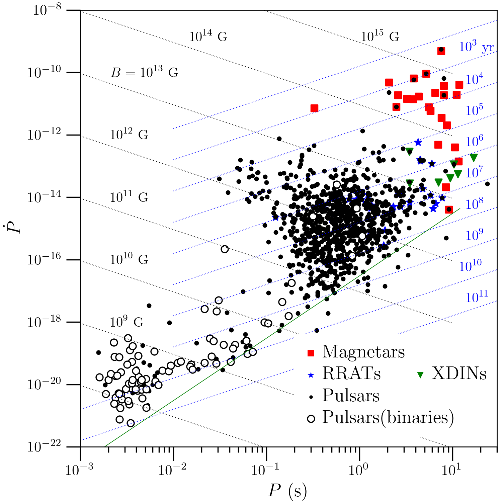

Neutron Star-Related Plots
==========================

This documentation was generated from git commit

.. include:: commit.rst

Licensing
---------

The C++ and python code provided here is license under the
:download:`GNU General Public License (v3)<static/gpl_license.txt>`
and the plots themselves, as provided in the repository, are
licensed as :download:`CC-BY-NC (4.0)<static/cc_by_nc_4.md>`.
	     
General notes
-------------

Some of the plots use data which is generated using C++ code which
requires `O2scl
<https://isospin.roam.utk.edu/static/code/o2scl>`_.
The python plots often require `O2sclpy
<https://isospin.roam.utk.edu/static/code/o2sclpy>`_ (but not `O2scl
<https://isospin.roam.utk.edu/static/code/o2scl>`_ since they
don't use the ``o2graph_plotter`` class).

Neutron star plot
-----------------

Based on Dany Page's excellent work `here
<http://www.astroscu.unam.mx/neutrones/home.html>`_. The python code
is in ``nstar_plot.py`` which also uses some of the functions in
``load_crust.py``. Because ``matplotlib`` has a hard time
rendering the fills properly, the ``PNG`` output uses the ImageMagick
utility ``convert``.

The limits on the magnetic field come from a maximum
of :math:`B=2 \times 10^{15}~\mathrm{G}` for
SGR 1806-20 [Woods07]_ and the minimum from estimates
using the :math:`P-\dot{P}` diagrams in [Karako-Argaman15]_.

The slowest rotation rate is :math:`4.2 \times 10^{-5}~\mathrm{Hz}`
for magnetar 1E 161348-5055 in [DAi16]_ (see also
:math:`0.085~\mathrm{Hz}` for 1E 1841-045 in [Dib14]_), and the
fastest observed rotation rate is :math:`716~\mathrm{Hz}` for PSR
J1748-2446ad in [Hessels06]_.

The radius range in the cutaway is taken from [Steiner16ns]_.

The crust properties are from the SLy4 model in [Steiner12dc]_.

The limits on the tidal deformability, moment of inertia, core energy
density, and core baryon density are taken from [Steiner15un]_.

The python code contains several options which can be easily changed
to change the look of the plot. 

.. image:: ../nstar_plot.png
   :width: 70%

EOS and M-R curve plot
----------------------

This is the EOS and M-R curve for Skyrme model NRAPR from
[Steiner05ia]_. The C++ code to generate the EOS and M-R data is in
`eos_mvsr.cpp` and this code creates the file `eos_mvsr.o2`. This is
the data file used by the python code to create the figure in
`eos_mvsr.py`.

.. image:: ../eos_mvsr.png
   :width: 70%

Neutron star crust plot
-----------------------
	     
.. image:: ../crust_plot.png
   :width: 70%

History of superconductivity plot
---------------------------------

Information on terrestrial superconductors based on P.J. Ray's work at
[Ray15]_. Nucleonic and quark gaps from [Bohr58]_, [Barrois77]_,
[Brown09]_, and [Page09ne]_ .
	   
.. image:: ../sfluid3.png
   :width: 70%
	     
Origin of the elements periodic table
-------------------------------------

Based on [Lodders03]_, [Simmerer04]_, [Johnson17]_, [Ivans17]_, ...

.. image:: ../periodic_table.png
   :width: 70%
	     
P pdot diagram
--------------

Lead nucleus cartoon
--------------------
	   
.. raw:: html
	 
   <video width="512" height="512" controls><source src="https://neutronstars.utk.edu/code/nstar_plot/_static/lead_nuc.mp4" type="video/mp4"></video>

	   
.. toctree::
   :maxdepth: 2

   bib

* :ref:`genindex`
* :ref:`modindex`
* :ref:`search`
