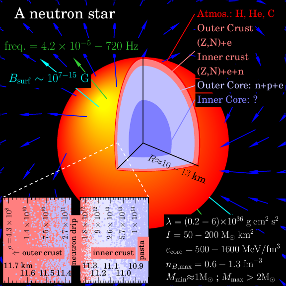

Neutron star plot
-----------------

Based on Dany Page's excellent work `here
<http://www.astroscu.unam.mx/neutrones/home.html>`_. The python code
is in ``nstar_plot.py`` which also uses some of the functions in
``load_crust.py``. Because ``matplotlib`` has a hard time
rendering the fills properly, the ``PNG`` output uses the ImageMagick
utility ``convert``.

The limits on the magnetic field come from a maximum
of :math:`B=2 \times 10^{15}~\mathrm{G}` for
SGR 1806-20 [Woods07]_ and the minimum from estimates
using the :math:`P-\dot{P}` diagrams in [Karako-Argaman15]_.

The slowest rotation rate is :math:`4.2 \times 10^{-5}~\mathrm{Hz}`
for magnetar 1E 161348-5055 in [DAi16]_ (see also
:math:`0.085~\mathrm{Hz}` for 1E 1841-045 in [Dib14]_), and the
fastest observed rotation rate is :math:`716~\mathrm{Hz}` for PSR
J1748-2446ad in [Hessels06]_.

The radius range in the cutaway is taken from [Steiner16ns]_.

The crust properties are from the SLy4 model in [Steiner12dc]_.

The limits on the tidal deformability, moment of inertia, core energy
density, and core baryon density are taken from [Steiner15un]_.

The python code contains several options which can be easily changed
to change the look of the plot. 

